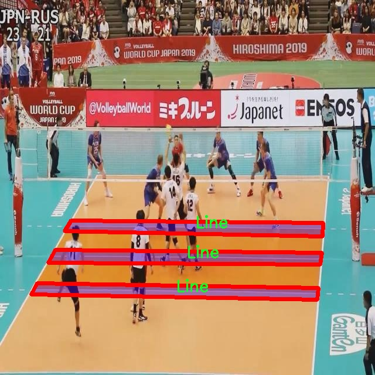

### 1.背景意义

研究背景与意义

随着体育运动的普及，排球作为一项受欢迎的团队运动，吸引了越来越多的参与者和观众。排球场地的标准化设计不仅有助于提升比赛的公平性和观赏性，同时也为运动员的训练和比赛提供了必要的环境保障。然而，传统的排球场地线检测方法往往依赖于人工观察和手动标记，效率低下且容易出现误差。因此，开发一种自动化的排球场地线检测系统显得尤为重要。

近年来，计算机视觉技术的迅猛发展为体育场地的自动检测提供了新的解决方案。特别是基于深度学习的目标检测算法，如YOLO（You Only Look Once），在实时物体检测中表现出色。YOLOv11作为YOLO系列的最新版本，结合了更高效的特征提取和更精确的定位能力，适合于复杂场景下的目标检测任务。通过对YOLOv11的改进，可以更好地适应排球场地线的检测需求，提升检测的准确性和实时性。

本研究基于一个包含10,000张排球场地图像的数据集，专注于场地线的实例分割任务。该数据集的设计不仅考虑了图像的多样性，还确保了标注的准确性，为模型的训练提供了良好的基础。通过对数据集的深入分析和处理，结合YOLOv11的优势，旨在构建一个高效的排球场地线检测系统，能够在实际应用中实现快速、准确的场地线识别。

本项目的意义在于，不仅可以提高排球比赛的自动化管理水平，还能为教练和运动员提供实时的场地信息反馈，帮助他们更好地进行战术分析和训练调整。此外，该系统的成功应用也为其他体育项目的场地检测提供了借鉴，推动了计算机视觉技术在体育领域的广泛应用。

### 2.视频效果

[2.1 视频效果](https://www.bilibili.com/video/BV1NkCFY4ENC/)

### 3.图片效果


##### [项目涉及的源码数据来源链接](https://kdocs.cn/l/cszuIiCKVNis)**

注意：本项目提供训练的数据集和训练教程,由于版本持续更新,暂不提供权重文件（best.pt）,请按照6.训练教程进行训练后实现上图演示的效果。

### 4.数据集信息

##### 4.1 本项目数据集类别数＆类别名

nc: 1
names: ['Line']


该项目为【图像分割】数据集，请在【训练教程和Web端加载模型教程（第三步）】这一步的时候按照【图像分割】部分的教程来训练

##### 4.2 本项目数据集信息介绍

本项目数据集信息介绍

本项目旨在改进YOLOv11的排球场地线检测系统，所使用的数据集名为“Volleyball Court Seg”。该数据集专注于排球场地的线条检测，具有重要的应用价值，尤其是在自动化裁判、比赛分析和场地监测等领域。数据集中包含的类别数量为1，具体类别为“Line”，这意味着所有的标注数据均围绕排球场地的线条进行，确保了数据集的专一性和针对性。

在数据集的构建过程中，我们收集了大量高质量的排球场地图像，这些图像涵盖了不同的场地布局、光照条件和视角，以增强模型的泛化能力。每张图像都经过精确的标注，确保线条的边界清晰可辨。这种细致的标注不仅提高了数据集的质量，也为后续的模型训练提供了坚实的基础。数据集中的图像多样性使得模型能够在各种实际场景中有效识别排球场地的线条，从而提升检测的准确性和鲁棒性。

此外，为了确保数据集的有效性，我们在数据预处理阶段进行了图像增强，包括旋转、缩放和颜色调整等操作。这些操作不仅丰富了数据集的内容，还有效地减少了模型在训练过程中的过拟合现象。通过这种方式，我们期望训练出的YOLOv11模型能够在不同的环境中准确地检测排球场地的线条，进而推动排球运动的智能化发展。

总之，“Volleyball Court Seg”数据集为本项目提供了一个强有力的基础，支持我们在排球场地线检测领域的深入研究与探索。通过不断优化数据集和训练策略，我们期待实现更高效、更精准的排球场地线检测系统。





### 5.全套项目环境部署视频教程（零基础手把手教学）

[5.1 所需软件PyCharm和Anaconda安装教程（第一步）](https://www.bilibili.com/video/BV1BoC1YCEKi/?spm_id_from=333.999.0.0&vd_source=bc9aec86d164b67a7004b996143742dc)


[5.2 安装Python虚拟环境创建和依赖库安装视频教程（第二步）](https://www.bilibili.com/video/BV1ZoC1YCEBw?spm_id_from=333.788.videopod.sections&vd_source=bc9aec86d164b67a7004b996143742dc)

### 6.改进YOLOv11训练教程和Web_UI前端加载模型教程（零基础手把手教学）

[6.1 改进YOLOv11训练教程和Web_UI前端加载模型教程（第三步）](https://www.bilibili.com/video/BV1BoC1YCEhR?spm_id_from=333.788.videopod.sections&vd_source=bc9aec86d164b67a7004b996143742dc)


按照上面的训练视频教程链接加载项目提供的数据集，运行train.py即可开始训练



     Epoch   gpu_mem       box       obj       cls    labels  img_size
     1/200     20.8G   0.01576   0.01955  0.007536        22      1280: 100%|██████████| 849/849 [14:42<00:00,  1.04s/it]
               Class     Images     Labels          P          R     mAP@.5 mAP@.5:.95: 100%|██████████| 213/213 [01:14<00:00,  2.87it/s]
                 all       3395      17314      0.994      0.957      0.0957      0.0843

     Epoch   gpu_mem       box       obj       cls    labels  img_size
     2/200     20.8G   0.01578   0.01923  0.007006        22      1280: 100%|██████████| 849/849 [14:44<00:00,  1.04s/it]
               Class     Images     Labels          P          R     mAP@.5 mAP@.5:.95: 100%|██████████| 213/213 [01:12<00:00,  2.95it/s]
                 all       3395      17314      0.996      0.956      0.0957      0.0845

     Epoch   gpu_mem       box       obj       cls    labels  img_size
     3/200     20.8G   0.01561    0.0191  0.006895        27      1280: 100%|██████████| 849/849 [10:56<00:00,  1.29it/s]
               Class     Images     Labels          P          R     mAP@.5 mAP@.5:.95: 100%|███████   | 187/213 [00:52<00:00,  4.04it/s]
                 all       3395      17314      0.996      0.957      0.0957      0.0845


###### [项目数据集下载链接](https://kdocs.cn/l/cszuIiCKVNis)

### 7.原始YOLOv11算法讲解

##### YOLO11简介

> YOLO11源码地址：https://github.com/ultralytics/ultralytics

Ultralytics
YOLO11是一款尖端的、最先进的模型，它在之前YOLO版本成功的基础上进行了构建，并引入了新功能和改进，以进一步提升性能和灵活性。YOLO11设计快速、准确且易于使用，使其成为各种物体检测和跟踪、实例分割、图像分类以及姿态估计任务的绝佳选择。  


**YOLO11创新点如下:**

YOLO 11主要改进包括：  
`增强的特征提取`：YOLO 11采用了改进的骨干和颈部架构，增强了特征提取功能，以实现更精确的目标检测。  
`优化的效率和速度`：优化的架构设计和优化的训练管道提供更快的处理速度，同时保持准确性和性能之间的平衡。  
`更高的精度，更少的参数`：YOLO11m在COCO数据集上实现了更高的平均精度（mAP），参数比YOLOv8m少22%，使其在不影响精度的情况下提高了计算效率。  
`跨环境的适应性`：YOLO 11可以部署在各种环境中，包括边缘设备、云平台和支持NVIDIA GPU的系统。  
`广泛的支持任务`：YOLO 11支持各种计算机视觉任务，如对象检测、实例分割、图像分类、姿态估计和面向对象检测（OBB）。

**YOLO11不同模型尺寸信息：**

YOLO11 提供5种不同的型号规模模型，以满足不同的应用需求：

Model| size (pixels)| mAPval 50-95| Speed CPU ONNX (ms)| Speed T4 TensorRT10
(ms)| params (M)| FLOPs (B)  
---|---|---|---|---|---|---  
YOLO11n| 640| 39.5| 56.1 ± 0.8| 1.5 ± 0.0| 2.6| 6.5  
YOLO11s| 640| 47.0| 90.0 ± 1.2| 2.5 ± 0.0| 9.4| 21.5  
YOLO11m| 640| 51.5| 183.2 ± 2.0| 4.7 ± 0.1| 20.1| 68.0  
YOLO11l| 640| 53.4| 238.6 ± 1.4| 6.2 ± 0.1| 25.3| 86.9  
YOLO11x| 640| 54.7| 462.8 ± 6.7| 11.3 ± 0.2| 56.9| 194.9  
  
**模型常用训练超参数参数说明：**  
`YOLOv11
模型的训练设置包括训练过程中使用的各种超参数和配置`。这些设置会影响模型的性能、速度和准确性。关键的训练设置包括批量大小、学习率、动量和权重衰减。此外，优化器、损失函数和训练数据集组成的选择也会影响训练过程。对这些设置进行仔细的调整和实验对于优化性能至关重要。  
**以下是一些常用的模型训练参数和说明：**

参数名| 默认值| 说明  
---|---|---  
`model`| `None`| 指定用于训练的模型文件。接受指向 `.pt` 预训练模型或 `.yaml`
配置文件。对于定义模型结构或初始化权重至关重要。  
`data`| `None`| 数据集配置文件的路径（例如
`coco8.yaml`).该文件包含特定于数据集的参数，包括训练数据和验证数据的路径、类名和类数。  
`epochs`| `100`| 训练总轮数。每个epoch代表对整个数据集进行一次完整的训练。调整该值会影响训练时间和模型性能。  
`patience`| `100`| 在验证指标没有改善的情况下，提前停止训练所需的epoch数。当性能趋于平稳时停止训练，有助于防止过度拟合。  
`batch`| `16`| 批量大小，有三种模式:设置为整数(例如，’ Batch =16 ‘)， 60% GPU内存利用率的自动模式(’ Batch
=-1 ‘)，或指定利用率分数的自动模式(’ Batch =0.70 ')。  
`imgsz`| `640`| 用于训练的目标图像尺寸。所有图像在输入模型前都会被调整到这一尺寸。影响模型精度和计算复杂度。  
`device`| `None`| 指定用于训练的计算设备：单个 GPU (`device=0`）、多个 GPU (`device=0,1`)、CPU
(`device=cpu`)，或苹果芯片的 MPS (`device=mps`).  
`workers`| `8`| 加载数据的工作线程数（每 `RANK` 多 GPU 训练）。影响数据预处理和输入模型的速度，尤其适用于多 GPU 设置。  
`name`| `None`| 训练运行的名称。用于在项目文件夹内创建一个子目录，用于存储训练日志和输出结果。  
`pretrained`| `True`| 决定是否从预处理模型开始训练。可以是布尔值，也可以是加载权重的特定模型的字符串路径。提高训练效率和模型性能。  
`optimizer`| `'auto'`| 为训练模型选择优化器。选项包括 `SGD`, `Adam`, `AdamW`, `NAdam`,
`RAdam`, `RMSProp` 等，或 `auto` 用于根据模型配置进行自动选择。影响收敛速度和稳定性  
`lr0`| `0.01`| 初始学习率（即 `SGD=1E-2`, `Adam=1E-3`) .调整这个值对优化过程至关重要，会影响模型权重的更新速度。  
`lrf`| `0.01`| 最终学习率占初始学习率的百分比 = (`lr0 * lrf`)，与调度程序结合使用，随着时间的推移调整学习率。  


**各损失函数作用说明：**  
`定位损失box_loss`：预测框与标定框之间的误差（GIoU），越小定位得越准；  
`分类损失cls_loss`：计算锚框与对应的标定分类是否正确，越小分类得越准；  
`动态特征损失（dfl_loss）`：DFLLoss是一种用于回归预测框与目标框之间距离的损失函数。在计算损失时，目标框需要缩放到特征图尺度，即除以相应的stride，并与预测的边界框计算Ciou
Loss，同时与预测的anchors中心点到各边的距离计算回归DFLLoss。  


### 8.200+种全套改进YOLOV11创新点原理讲解

#### 8.1 200+种全套改进YOLOV11创新点原理讲解大全

由于篇幅限制，每个创新点的具体原理讲解就不全部展开，具体见下列网址中的改进模块对应项目的技术原理博客网址【Blog】（创新点均为模块化搭建，原理适配YOLOv5~YOLOv11等各种版本）

[改进模块技术原理博客【Blog】网址链接](https://gitee.com/qunmasj/good)


#### 8.2 精选部分改进YOLOV11创新点原理讲解

###### 这里节选部分改进创新点展开原理讲解(完整的改进原理见上图和[改进模块技术原理博客链接](https://gitee.com/qunmasj/good)【如果此小节的图加载失败可以通过CSDN或者Github搜索该博客的标题访问原始博客，原始博客图片显示正常】


### OREPA：在线卷积重参数化
卷积神经网络(CNNs)已经在许多计算机视觉任务的应用成功，包括图像分类、目标检测、语义分割等。精度和模型效率之间的权衡也已被广泛讨论。

一般来说，一个精度较高的模型通常需要一个更复杂的块，一个更宽或更深的结构。然而，这样的模型总是太重，无法部署，特别是在硬件性能有限、需要实时推理的场景下。考虑到效率，更小、更紧凑和更快的模型自然是首选。

为了获得一个部署友好且高精度的模型，有研究者提出了基于结构重参数化的方法来释放性能。在这些方法中，模型在训练阶段和推理阶段有不同的结构。具体来说，使用复杂的训练阶段拓扑，即重参数化的块，来提高性能。训练结束后，通过等效变换将一个复杂的块重参为成一个单一的线性层。重参后的模型通常具有一个整洁架构模型，例如，通常是一个类似VGG的或一个类似ResNet的结构。从这个角度来看，重参化策略可以在不引入额外的推理时间成本的情况下提高模型的性能。


BN层是重构模型的关键组成部分。在一个重新解析块(图1(b))中，在每个卷积层之后立即添加一个BN层。可以观察到，去除这些BN层会导致的性能退化。然而，当考虑到效率时，这种BN层的使用出乎意料地在训练阶段带来了巨大的计算开销。在推理阶段，复杂的块可以被压缩成一个卷积层。但是，在训练过程中，BN层是非线性的，也就是说，它们将特征映射除以它的标准差，这就阻止了合并整个块。因此，存在大量的中间计算操作(large FLOPS)和缓冲特征映射(high memory usage)。更糟糕的是，这么高的训练预算使得很难探索更复杂和可能更强的重参块。很自然地，下面的问题就出现了：

为什么标准化在重参中这么重要？

通过分析和实验，作者认为BN层中的尺度因子最重要，因为它们能够使不同分支的优化方向多样化。

基于观察结果，作者提出了在线重参化(OREPA)(图1(c))，这是一个两阶段的pipeline，使之能够简化复杂的training-time re-param block。

在第一阶段，block linearization，去除所有的非线性BN层，并引入线性缩放层。这些层与BN层具有相似的性质，因此它们使不同分支的优化多样化。此外，这些层都是线性的，可以在训练过程中合并成卷积层。

第二阶段，block squeezing，将复杂的线性块简化为单一的卷积层。OREPA通过减少由中间计算层引起的计算和存储开销，显著降低了训练成本，对性能只有非常小的影响。

此外，高效化使得探索更复杂的重参化拓扑成为可能。为了验证这一点，作者进一步提出了几个重参化的组件，以获得更好的性能。

在ImageNet分类任务上评估了所提出的OREPA。与最先进的修复模型相比，OREPA将额外的训练时间GPU内存成本降低了65%到75%，并将训练过程加快了1.5-2.3倍。同时，OREPA-ResNet和OREPA-VGG的性能始终优于+0.2%∼+0.6%之前的DBB和RepVGG方法。同时作者还评估了在下游任务上的OREPA，即目标检测和语义分割。作者发现OREPA可以在这些任务上也可以带来性能的提高。

提出了在线卷积重参化(OREPA)策略，这极大地提高了重参化模型的训练效率，并使探索更强的重参化块成为可能；

通过对重参化模型工作机制的分析，用引入的线性尺度层代替BN层，这仍然提供了不同的优化方向，并保持了表示能力;

在各种视觉任务上的实验表明，OREPA在准确性和训练效率方面都优于以前的重参化模型(DBB/RepVGG)。


#### 结构重参化
结构重参化最近被重视并应用于许多计算机视觉任务，如紧凑模型设计、架构搜索和剪枝。重参化意味着不同的架构可以通过参数的等价转换来相互转换。例如，1×1卷积的一个分支和3×3卷积的一个分支，可以转移到3×3卷积的单个分支中。在训练阶段，设计了多分支和多层拓扑来取代普通的线性层(如conv或全连接层)来增强模型。Cao等讨论了如何在训练过程中合并深度可分离卷积核。然后在推理过程中，将训练时间的复杂模型转移到简单模型中，以便于更快的推理。

在受益于复杂的training-time拓扑，同时，当前的重参化方法训练使用不可忽略的额外计算成本。当块变得更复杂以变得更强的表示时，GPU内存利用率和训练时间将会越来越长，最终走向不可接受。与以往的重参化方法不同，本文更多地关注训练成本。提出了一种通用的在线卷积重参化策略，使training-time的结构重参化成为可能。


#### Normalization
BN被提出来缓解训练非常深度神经网络时的梯度消失问题。人们认为BN层是非常重要的，因为它们平滑了损失。最近关于无BN神经网络的研究声称，BN层并不是不可或缺的。通过良好的初始化和适当的正则化，可以优雅地去除BN层。

对于重参化模型，作者认为重参化块中的BN层是关键的。无BN的变体将会出现性能下降。然而，BN层是非线性的，也就是说，它们将特征图除以它的标准差，这阻止了在线合并块。为了使在线重参化可行，作者去掉了重参块中的所有BN层，并引入了BN层的线性替代方法，即线性缩放层。

#### 卷积分解
标准卷积层计算比较密集，导致大的FLOPs和参数量。因此，卷积分解方法被提出，并广泛应用于移动设备的轻量化模型中。重参化方法也可以看作是卷积分解的某种形式，但它更倾向于更复杂的拓扑结构。本文的方法的不同之处在于，在kernel-level上分解卷积，而不是在structure level。

#### 在线重参化
在本节中，首先，分析了关键组件，即重参化模型中的BN层，在此基础上提出了在线重参化(OREPA)，旨在大大减少再参数化模型的训练时间预算。OREPA能够将复杂的训练时间块简化为一个卷积层，并保持了较高的精度。

OREPA的整体pipeline如图所示，它包括一个Block Linearization阶段和一个Block Squeezing阶段。


参考该博客通过分析多层和多分支结构的优化多样性，深入研究了重参化的有效性，并证明了所提出的线性缩放层和BN层具有相似的效果。

最后，随着训练预算的减少，进一步探索了更多的组件，以实现更强的重参化模型，成本略有增加。

#### 重参化中的Normalization
作者认为中间BN层是重参化过程中多层和多分支结构的关键组成部分。以SoTA模型DBB和RepVGG为例，去除这些层会导致严重的性能下降，如表1所示。


这种观察结果也得到了Ding等人的实验支持。因此，作者认为中间的BN层对于重参化模型的性能是必不可少的。

然而，中间BN层的使用带来了更高的训练预算。作者注意到，在推理阶段，重参化块中的所有中间操作都是线性的，因此可以合并成一个卷积层，从而形成一个简单的结构。

但在训练过程中，BN层是非线性的，即它们将特征映射除以其标准差。因此，中间操作应该单独计算，这将导致更高的计算和内存成本。更糟糕的是，如此高的成本将阻止探索更强大的训练模块。

#### Block Linearization
如3.1中所述，中间的BN层阻止了在训练过程中合并单独的层。然而，由于性能问题，直接删除它们并不简单。为了解决这一困境，作者引入了channel级线性尺度操作作为BN的线性替代方法。

缩放层包含一个可学习的向量，它在通道维度中缩放特征映射。线性缩放层具有与BN层相似的效果，它们都促进多分支向不同的方向进行优化，这是重参化时性能提高的关键。除了对性能的影响外，线性缩放层还可以在训练过程中进行合并，使在线重参化成为可能。


基于线性缩放层，作者修改了重参化块，如图所示。具体来说，块的线性化阶段由以下3个步骤组成：

首先，删除了所有的非线性层，即重参化块中的BN层

其次，为了保持优化的多样性，在每个分支的末尾添加了一个缩放层，这是BN的线性替代方法

最后，为了稳定训练过程，在所有分支的添加后添加一个BN层。

一旦完成线性化阶段，在重参化块中只存在线性层，这意味着可以在训练阶段合并块中的所有组件。

#### Block Squeezing
Block Squeezing步骤将计算和内存昂贵的中间特征映射上的操作转换为更经济的kernel上的操作。这意味着在计算和内存方面从减少到，其中、是特征图和卷积核的空间尺寸。

一般来说，无论线性重参化块是多么复杂，以下2个属性始终成立：

Block中的所有线性层，例如深度卷积、平均池化和所提出的线性缩放，都可以用带有相应参数的退化卷积层来表示;

Block可以由一系列并行分支表示，每个分支由一系列卷积层组成。

有了上述两个特性，如果可以将

多层（即顺序结构）

多分支（即并行结构）

简化为单一卷积，就可以压缩一个块。在下面的部分中，将展示如何简化顺序结构(图(a))和并行结构(图(b))。


### 9.系统功能展示

图9.1.系统支持检测结果表格显示

  图9.2.系统支持置信度和IOU阈值手动调节

  图9.3.系统支持自定义加载权重文件best.pt(需要你通过步骤5中训练获得)

  图9.4.系统支持摄像头实时识别

  图9.5.系统支持图片识别

  图9.6.系统支持视频识别

  图9.7.系统支持识别结果文件自动保存

  图9.8.系统支持Excel导出检测结果数据


### 10. YOLOv11核心改进源码讲解

#### 10.1 rmt.py

以下是对给定代码的核心部分进行分析和注释的结果。代码主要实现了一个视觉变换器（Vision Transformer）模型，包含多个模块，如注意力机制、前馈网络、残差块等。

```python
import torch
import torch.nn as nn
import torch.nn.functional as F

# 定义深度可分离卷积类
class DWConv2d(nn.Module):
    def __init__(self, dim, kernel_size, stride, padding):
        super().__init__()
        # 使用分组卷积实现深度可分离卷积
        self.conv = nn.Conv2d(dim, dim, kernel_size, stride, padding, groups=dim)

    def forward(self, x: torch.Tensor):
        '''
        x: 输入张量，形状为 (b, h, w, c)
        '''
        x = x.permute(0, 3, 1, 2)  # 转换为 (b, c, h, w)
        x = self.conv(x)  # 进行卷积操作
        x = x.permute(0, 2, 3, 1)  # 转换回 (b, h, w, c)
        return x

# 定义相对位置编码类
class RelPos2d(nn.Module):
    def __init__(self, embed_dim, num_heads, initial_value, heads_range):
        super().__init__()
        # 初始化相对位置编码的参数
        angle = 1.0 / (10000 ** torch.linspace(0, 1, embed_dim // num_heads // 2))
        angle = angle.unsqueeze(-1).repeat(1, 2).flatten()
        self.initial_value = initial_value
        self.heads_range = heads_range
        self.num_heads = num_heads
        decay = torch.log(1 - 2 ** (-initial_value - heads_range * torch.arange(num_heads, dtype=torch.float) / num_heads))
        self.register_buffer('angle', angle)
        self.register_buffer('decay', decay)

    def generate_2d_decay(self, H: int, W: int):
        '''
        生成二维衰减掩码，结果形状为 (HW)*(HW)
        '''
        index_h = torch.arange(H).to(self.decay)
        index_w = torch.arange(W).to(self.decay)
        grid = torch.meshgrid([index_h, index_w])
        grid = torch.stack(grid, dim=-1).reshape(H*W, 2)  # (H*W, 2)
        mask = grid[:, None, :] - grid[None, :, :]  # (H*W, H*W, 2)
        mask = (mask.abs()).sum(dim=-1)
        mask = mask * self.decay[:, None, None]  # (n, H*W, H*W)
        return mask

    def forward(self, slen: Tuple[int]):
        '''
        slen: 输入的长度，(h, w)
        '''
        mask = self.generate_2d_decay(slen[0], slen[1])  # 生成二维衰减掩码
        return mask

# 定义多头自注意力机制类
class MaSA(nn.Module):
    def __init__(self, embed_dim, num_heads, value_factor=1):
        super().__init__()
        self.factor = value_factor
        self.embed_dim = embed_dim
        self.num_heads = num_heads
        self.head_dim = self.embed_dim * self.factor // num_heads
        self.key_dim = self.embed_dim // num_heads
        self.scaling = self.key_dim ** -0.5
        # 定义线性变换层
        self.q_proj = nn.Linear(embed_dim, embed_dim, bias=True)
        self.k_proj = nn.Linear(embed_dim, embed_dim, bias=True)
        self.v_proj = nn.Linear(embed_dim, embed_dim * self.factor, bias=True)
        self.lepe = DWConv2d(embed_dim, 5, 1, 2)  # 深度可分离卷积
        self.out_proj = nn.Linear(embed_dim * self.factor, embed_dim, bias=True)
        self.reset_parameters()

    def reset_parameters(self):
        # 初始化权重
        nn.init.xavier_normal_(self.q_proj.weight)
        nn.init.xavier_normal_(self.k_proj.weight)
        nn.init.xavier_normal_(self.v_proj.weight)
        nn.init.xavier_normal_(self.out_proj.weight)

    def forward(self, x: torch.Tensor, rel_pos):
        '''
        x: 输入张量，形状为 (b, h, w, c)
        rel_pos: 相对位置编码
        '''
        bsz, h, w, _ = x.size()
        q = self.q_proj(x)  # 计算查询
        k = self.k_proj(x)  # 计算键
        v = self.v_proj(x)  # 计算值
        lepe = self.lepe(v)  # 进行深度可分离卷积

        k *= self.scaling  # 缩放键
        # 计算注意力矩阵
        qk_mat = (q @ k.transpose(-1, -2)) + rel_pos  # 加上相对位置编码
        qk_mat = torch.softmax(qk_mat, -1)  # 计算softmax
        output = torch.matmul(qk_mat, v)  # 计算输出

        output = output + lepe  # 加上卷积结果
        output = self.out_proj(output)  # 线性变换
        return output

# 定义前馈网络类
class FeedForwardNetwork(nn.Module):
    def __init__(self, embed_dim, ffn_dim, activation_fn=F.gelu, dropout=0.0):
        super().__init__()
        self.fc1 = nn.Linear(embed_dim, ffn_dim)  # 第一层线性变换
        self.fc2 = nn.Linear(ffn_dim, embed_dim)  # 第二层线性变换
        self.dropout = nn.Dropout(dropout)  # dropout层
        self.activation_fn = activation_fn  # 激活函数

    def forward(self, x: torch.Tensor):
        '''
        x: 输入张量，形状为 (b, h, w, c)
        '''
        x = self.fc1(x)  # 第一层线性变换
        x = self.activation_fn(x)  # 激活
        x = self.dropout(x)  # dropout
        x = self.fc2(x)  # 第二层线性变换
        return x

# 定义残差块类
class RetBlock(nn.Module):
    def __init__(self, embed_dim: int, num_heads: int, ffn_dim: int):
        super().__init__()
        self.retention = MaSA(embed_dim, num_heads)  # 自注意力机制
        self.ffn = FeedForwardNetwork(embed_dim, ffn_dim)  # 前馈网络
        self.norm1 = nn.LayerNorm(embed_dim)  # 归一化层
        self.norm2 = nn.LayerNorm(embed_dim)  # 归一化层

    def forward(self, x: torch.Tensor):
        '''
        x: 输入张量，形状为 (b, h, w, c)
        '''
        residual = x  # 残差连接
        x = self.norm1(x)  # 归一化
        x = self.retention(x)  # 自注意力
        x += residual  # 残差连接

        residual = x  # 更新残差
        x = self.norm2(x)  # 归一化
        x = self.ffn(x)  # 前馈网络
        x += residual  # 残差连接
        return x

# 定义主模型类
class VisRetNet(nn.Module):
    def __init__(self, in_chans=3, num_classes=1000, embed_dims=[96, 192, 384, 768], depths=[2, 2, 6, 2], num_heads=[3, 6, 12, 24]):
        super().__init__()
        self.patch_embed = PatchEmbed(in_chans=in_chans, embed_dim=embed_dims[0])  # 图像分块嵌入
        self.layers = nn.ModuleList()  # 存储每一层

        # 构建每一层
        for i in range(len(depths)):
            layer = BasicLayer(embed_dim=embed_dims[i], depth=depths[i], num_heads=num_heads[i])
            self.layers.append(layer)

    def forward(self, x):
        x = self.patch_embed(x)  # 图像分块嵌入
        for layer in self.layers:
            x = layer(x)  # 逐层前向传播
        return x

# 定义模型构造函数
def RMT_T():
    model = VisRetNet(
        embed_dims=[64, 128, 256, 512],
        depths=[2, 2, 8, 2],
        num_heads=[4, 4, 8, 16]
    )
    return model

if __name__ == '__main__':
    model = RMT_T()  # 创建模型
    inputs = torch.randn((1, 3, 640, 640))  # 创建输入张量
    res = model(inputs)  # 前向传播
    for i in res:
        print(i.size())  # 输出每层的形状
```

### 代码核心部分说明：
1. **DWConv2d**: 实现深度可分离卷积，用于特征提取。
2. **RelPos2d**: 生成二维相对位置编码，增强模型对位置的感知能力。
3. **MaSA**: 多头自注意力机制，计算输入的注意力权重并输出加权特征。
4. **FeedForwardNetwork**: 前馈神经网络，包含两个线性层和激活函数。
5. **RetBlock**: 残差块，结合自注意力和前馈网络，进行特征的增强和信息的传递。
6. **VisRetNet**: 主模型类，整合各个模块，完成从输入图像到特征提取的过程。

### 总结：
该代码实现了一个基于视觉变换器的深度学习模型，采用了多头自注意力机制和前馈网络，能够有效地处理图像数据并提取特征。

该文件`rmt.py`实现了一个视觉变换器（Vision Transformer）模型，名为`VisRetNet`，并提供了不同规模的模型构造函数（如`RMT_T`、`RMT_S`、`RMT_B`和`RMT_L`）。整个模型的设计是为了处理图像数据，利用自注意力机制和卷积操作来提取特征。

首先，文件中导入了必要的库，包括`torch`和`torch.nn`，以及一些辅助模块，如`DropPath`、`trunc_normal_`等。接着定义了一些基础组件，以下是各个组件的简要说明：

1. **DWConv2d**：实现了深度可分离卷积的模块。它将输入的张量从形状 `(b, h, w, c)` 转换为 `(b, c, h, w)`，然后应用卷积操作，最后再转换回原来的形状。

2. **RelPos2d**：实现了二维相对位置编码的模块。该模块用于生成相对位置的衰减掩码，支持生成一维和二维的衰减掩码，以便在自注意力计算中使用。

3. **MaSAd** 和 **MaSA**：这两个模块实现了不同类型的自注意力机制。`MaSAd`使用了衰减的相对位置编码，而`MaSA`则使用了标准的相对位置编码。它们都包含了查询、键、值的线性变换，并通过自注意力机制计算输出。

4. **FeedForwardNetwork**：实现了前馈神经网络模块，包含两个线性层和激活函数，支持dropout和层归一化。

5. **RetBlock**：这是一个残差块，包含了自注意力层和前馈网络，支持层归一化和可选的层缩放。

6. **PatchMerging**：实现了图像块合并的模块，将输入特征图的尺寸减半，并增加通道数。

7. **BasicLayer**：构建了一个基本的变换器层，包含多个残差块和可选的下采样层。

8. **LayerNorm2d**：实现了二维层归一化，适用于特征图。

9. **PatchEmbed**：将输入图像分割成不重叠的块，并进行线性投影，输出嵌入特征。

10. **VisRetNet**：主模型类，整合了上述组件，构建了多层的视觉变换器。它支持多种参数配置，包括嵌入维度、层数、头数等，并在前向传播中处理输入图像。

最后，文件中定义了四个函数（`RMT_T`、`RMT_S`、`RMT_B`、`RMT_L`），分别用于创建不同规模的`VisRetNet`模型。每个函数都设置了不同的超参数，以适应不同的任务需求。

在`__main__`部分，代码示例展示了如何创建一个`RMT_T`模型并进行一次前向传播，输入为随机生成的图像数据，最后打印出每个输出特征的尺寸。这些输出特征可以用于后续的分类或其他视觉任务。

#### 10.2 repvit.py

以下是代码中最核心的部分，并附上详细的中文注释：

```python
import torch.nn as nn
import torch

class Conv2d_BN(torch.nn.Sequential):
    def __init__(self, a, b, ks=1, stride=1, pad=0, dilation=1,
                 groups=1, bn_weight_init=1):
        """
        初始化卷积层和批归一化层的组合
        :param a: 输入通道数
        :param b: 输出通道数
        :param ks: 卷积核大小
        :param stride: 步幅
        :param pad: 填充
        :param dilation: 膨胀卷积的膨胀系数
        :param groups: 分组卷积的组数
        :param bn_weight_init: 批归一化层权重初始化值
        """
        super().__init__()
        # 添加卷积层
        self.add_module('c', torch.nn.Conv2d(
            a, b, ks, stride, pad, dilation, groups, bias=False))
        # 添加批归一化层
        self.add_module('bn', torch.nn.BatchNorm2d(b))
        # 初始化批归一化层的权重和偏置
        torch.nn.init.constant_(self.bn.weight, bn_weight_init)
        torch.nn.init.constant_(self.bn.bias, 0)

    @torch.no_grad()
    def fuse_self(self):
        """
        融合卷积层和批归一化层为一个卷积层
        :return: 融合后的卷积层
        """
        c, bn = self._modules.values()  # 获取卷积层和批归一化层
        # 计算新的卷积权重和偏置
        w = bn.weight / (bn.running_var + bn.eps)**0.5
        w = c.weight * w[:, None, None, None]
        b = bn.bias - bn.running_mean * bn.weight / (bn.running_var + bn.eps)**0.5
        # 创建新的卷积层
        m = torch.nn.Conv2d(w.size(1) * self.c.groups, w.size(0), w.shape[2:], 
                            stride=self.c.stride, padding=self.c.padding, 
                            dilation=self.c.dilation, groups=self.c.groups,
                            device=c.weight.device)
        m.weight.data.copy_(w)  # 复制权重
        m.bias.data.copy_(b)    # 复制偏置
        return m

class RepViTBlock(nn.Module):
    def __init__(self, inp, hidden_dim, oup, kernel_size, stride, use_se, use_hs):
        """
        初始化RepViT块
        :param inp: 输入通道数
        :param hidden_dim: 隐藏层通道数
        :param oup: 输出通道数
        :param kernel_size: 卷积核大小
        :param stride: 步幅
        :param use_se: 是否使用Squeeze-and-Excitation
        :param use_hs: 是否使用Hard Swish激活函数
        """
        super(RepViTBlock, self).__init__()
        self.identity = stride == 1 and inp == oup  # 判断是否为身份映射
        assert(hidden_dim == 2 * inp)  # 隐藏层通道数是输入通道数的两倍

        if stride == 2:
            # 如果步幅为2，进行下采样
            self.token_mixer = nn.Sequential(
                Conv2d_BN(inp, inp, kernel_size, stride, (kernel_size - 1) // 2, groups=inp),
                nn.Identity() if not use_se else SqueezeExcite(inp, 0.25),
                Conv2d_BN(inp, oup, ks=1, stride=1, pad=0)
            )
            self.channel_mixer = Residual(nn.Sequential(
                Conv2d_BN(oup, 2 * oup, 1, 1, 0),
                nn.GELU() if use_hs else nn.GELU(),
                Conv2d_BN(2 * oup, oup, 1, 1, 0, bn_weight_init=0),
            ))
        else:
            assert(self.identity)  # 确保是身份映射
            self.token_mixer = nn.Sequential(
                RepVGGDW(inp),
                nn.Identity() if not use_se else SqueezeExcite(inp, 0.25),
            )
            self.channel_mixer = Residual(nn.Sequential(
                Conv2d_BN(inp, hidden_dim, 1, 1, 0),
                nn.GELU() if use_hs else nn.GELU(),
                Conv2d_BN(hidden_dim, oup, 1, 1, 0, bn_weight_init=0),
            ))

    def forward(self, x):
        """
        前向传播
        :param x: 输入张量
        :return: 输出张量
        """
        return self.channel_mixer(self.token_mixer(x))

class RepViT(nn.Module):
    def __init__(self, cfgs):
        """
        初始化RepViT模型
        :param cfgs: 配置列表，定义了每个块的参数
        """
        super(RepViT, self).__init__()
        self.cfgs = cfgs  # 保存配置

        # 构建第一个层
        input_channel = self.cfgs[0][2]
        patch_embed = torch.nn.Sequential(
            Conv2d_BN(3, input_channel // 2, 3, 2, 1), 
            torch.nn.GELU(),
            Conv2d_BN(input_channel // 2, input_channel, 3, 2, 1)
        )
        layers = [patch_embed]  # 存储所有层
        block = RepViTBlock  # 使用的块类型
        for k, t, c, use_se, use_hs, s in self.cfgs:
            output_channel = _make_divisible(c, 8)  # 确保输出通道数可被8整除
            exp_size = _make_divisible(input_channel * t, 8)  # 扩展通道数
            layers.append(block(input_channel, exp_size, output_channel, k, s, use_se, use_hs))
            input_channel = output_channel  # 更新输入通道数
        self.features = nn.ModuleList(layers)  # 将所有层存储为ModuleList

    def forward(self, x):
        """
        前向传播
        :param x: 输入张量
        :return: 特征列表
        """
        input_size = x.size(2)
        scale = [4, 8, 16, 32]  # 特征图缩放比例
        features = [None] * len(scale)  # 初始化特征列表
        for f in self.features:
            x = f(x)  # 通过每一层
            if input_size // x.size(2) in scale:
                features[scale.index(input_size // x.size(2))] = x  # 保存特征
        return features  # 返回特征列表
```

### 代码核心部分说明：
1. **Conv2d_BN**: 这是一个自定义的卷积层，结合了卷积和批归一化，提供了融合功能以优化模型性能。
2. **RepViTBlock**: 这是RepViT模型的基本构建块，包含了通道混合和token混合的操作，支持身份映射和下采样。
3. **RepViT**: 这是整个模型的实现，负责构建网络结构并执行前向传播。

### 重要功能：
- **融合功能**: `fuse_self`方法可以将卷积层和批归一化层融合为一个卷积层，减少计算量。
- **动态特征提取**: 在前向传播中，模型能够根据输入大小动态提取特征。

这个程序文件 `repvit.py` 实现了一个名为 RepViT 的深度学习模型，主要用于计算机视觉任务。该模型结合了卷积神经网络（CNN）和视觉变换器（ViT）的优点，采用了一系列的模块和结构来提高性能。

首先，程序导入了必要的库，包括 PyTorch 的神经网络模块 `torch.nn`、NumPy 以及用于实现 Squeeze-and-Excitation（SE）机制的 `SqueezeExcite`。然后，定义了一些函数和类来构建模型。

`replace_batchnorm` 函数用于遍历网络中的所有子模块，将 Batch Normalization 层替换为身份映射（Identity），以便在推理时提高效率。`_make_divisible` 函数确保网络中所有层的通道数都是 8 的倍数，这是为了与某些硬件加速器的要求相兼容。

接下来，定义了几个类来构建模型的基本单元。`Conv2d_BN` 类结合了卷积层和 Batch Normalization 层，并提供了一个 `fuse_self` 方法来合并这两个层，以减少计算开销。`Residual` 类实现了残差连接，允许输入直接加到输出上，从而缓解深层网络中的梯度消失问题。`RepVGGDW` 类则是一个特定的卷积模块，采用深度可分离卷积的方式来提高计算效率。

`RepViTBlock` 类是 RepViT 的基本构建块，包含了通道混合和标记混合的逻辑，使用了前面定义的模块。它的构造函数根据输入参数设置不同的卷积层和激活函数。`RepViT` 类则是整个模型的实现，构造了一个包含多个 `RepViTBlock` 的序列，并定义了前向传播的方法。

在模型的构造过程中，使用了配置列表 `cfgs` 来定义每个块的参数，包括卷积核大小、扩展因子、输出通道数、是否使用 Squeeze-and-Excitation 机制等。模型的前向传播方法会根据输入的大小返回不同尺度的特征图。

此外，`switch_to_deploy` 方法用于将模型切换到推理模式，调用 `replace_batchnorm` 函数来优化模型。`update_weight` 函数则用于加载预训练权重，确保模型的权重与给定的权重字典匹配。

最后，文件中定义了多个函数（如 `repvit_m0_9`、`repvit_m1_0` 等）来构建不同配置的 RepViT 模型，并可以选择加载预训练权重。在 `__main__` 部分，演示了如何实例化一个模型并进行前向推理，输出每个特征图的尺寸。

总体来说，这个程序实现了一个灵活且高效的视觉模型，适用于各种计算机视觉任务，并通过模块化设计提高了可维护性和可扩展性。

#### 10.3 block.py

以下是经过简化和注释的核心代码部分，主要保留了关键的类和函数，并对其进行了详细的中文注释：

```python
import torch
import torch.nn as nn
import torch.nn.functional as F

# 自动填充函数，用于保持输出形状与输入相同
def autopad(k, p=None, d=1):  
    """Pad to 'same' shape outputs."""
    if d > 1:
        k = d * (k - 1) + 1 if isinstance(k, int) else [d * (x - 1) + 1 for x in k]  # 实际的卷积核大小
    if p is None:
        p = k // 2 if isinstance(k, int) else [x // 2 for x in k]  # 自动填充
    return p

# 定义Swish激活函数
class swish(nn.Module):
    def forward(self, x):
        return x * torch.sigmoid(x)

# 定义带有可调节的ReLU的模块
class DyReLU(nn.Module):
    def __init__(self, inp, reduction=4, lambda_a=1.0, use_bias=True):
        super(DyReLU, self).__init__()
        self.oup = inp
        self.lambda_a = lambda_a * 2
        self.avg_pool = nn.AdaptiveAvgPool2d(1)  # 自适应平均池化

        # 定义全连接层
        self.fc = nn.Sequential(
            nn.Linear(inp, inp // reduction),
            nn.ReLU(inplace=True),
            nn.Linear(inp // reduction, self.oup * 2),  # 输出两个参数
            nn.Sigmoid()  # 使用Sigmoid激活
        )

    def forward(self, x):
        y = self.avg_pool(x).view(x.size(0), -1)  # 池化后展平
        y = self.fc(y).view(x.size(0), self.oup * 2, 1, 1)  # 重新调整形状
        a, b = torch.split(y, self.oup, dim=1)  # 分割参数
        out = x * a + b  # 计算输出
        return out

# 定义动态卷积模块
class DyDCNv2(nn.Module):
    def __init__(self, in_channels, out_channels):
        super().__init__()
        self.conv = nn.Conv2d(in_channels, out_channels, kernel_size=3, padding=1)  # 标准卷积
        self.offset = nn.Conv2d(in_channels, 18, kernel_size=3, padding=1)  # 偏移卷积

    def forward(self, x):
        offset = self.offset(x)  # 计算偏移
        # 这里可以添加对偏移的处理逻辑
        return self.conv(x)  # 返回卷积结果

# 定义DyHeadBlock类，包含多个注意力机制
class DyHeadBlock(nn.Module):
    def __init__(self, in_channels):
        super().__init__()
        self.spatial_conv = DyDCNv2(in_channels, in_channels)  # 空间卷积
        self.task_attn_module = DyReLU(in_channels)  # 任务注意力模块

    def forward(self, x):
        mid_feat = self.spatial_conv(x)  # 中间特征
        out = self.task_attn_module(mid_feat)  # 任务注意力输出
        return out

# 定义融合模块
class Fusion(nn.Module):
    def __init__(self, inc_list):
        super().__init__()
        self.fusion_weight = nn.Parameter(torch.ones(len(inc_list), dtype=torch.float32), requires_grad=True)  # 融合权重

    def forward(self, x):
        fusion_weight = F.softmax(self.fusion_weight, dim=0)  # 计算融合权重
        return torch.sum(torch.stack([x[i] * fusion_weight[i] for i in range(len(x))], dim=0), dim=0)  # 融合特征

# 定义动态对齐融合模块
class DynamicAlignFusion(nn.Module):
    def __init__(self, inc, ouc):
        super().__init__()
        self.conv_align1 = nn.Conv2d(inc[0], ouc, 1)  # 对齐卷积
        self.conv_align2 = nn.Conv2d(inc[1], ouc, 1)  # 对齐卷积

    def forward(self, x):
        x1, x2 = x
        x1, x2 = self.conv_align1(x1), self.conv_align2(x2)  # 对齐输入特征
        return x1 + x2  # 返回融合结果

# 定义特征金字塔共享卷积模块
class FeaturePyramidSharedConv(nn.Module):
    def __init__(self, c1, c2):
        super().__init__()
        self.conv1 = nn.Conv2d(c1, c2, 1)  # 卷积层

    def forward(self, x):
        return self.conv1(x)  # 返回卷积结果

# 定义上下文引导融合模块
class ContextGuideFusionModule(nn.Module):
    def __init__(self, inc):
        super().__init__()
        self.adjust_conv = nn.Conv(inc[0], inc[1], k=1) if inc[0] != inc[1] else nn.Identity()  # 调整卷积

    def forward(self, x):
        x0, x1 = x
        x0 = self.adjust_conv(x0)  # 调整特征
        return x0 + x1  # 返回融合结果

# 以上是经过简化和注释的核心代码部分，涵盖了动态卷积、注意力机制、融合模块等重要功能。
```

这段代码保留了主要的模块和功能，提供了对每个类和函数的中文注释，以帮助理解其用途和实现逻辑。

这个 `block.py` 文件包含了多个深度学习模型组件，主要用于构建卷积神经网络（CNN）和注意力机制，尤其是在图像处理和计算机视觉任务中。以下是对文件中主要内容的说明：

首先，文件导入了必要的库，包括 PyTorch、NumPy、以及一些自定义模块和函数。接着，定义了一系列的卷积块、注意力机制、和其他辅助功能模块。

文件中定义的模块主要包括：

1. **卷积块**：如 `Bottleneck`、`C3k`、`C3k2` 等，都是用于构建网络的基本单元。`Bottleneck` 是一种常见的结构，通常用于减少参数量和计算量，同时保持模型的表达能力。

2. **注意力机制**：文件中实现了多种注意力机制，包括 `GOLDYOLO_Attention`、`SMA`、`PSA` 等。这些机制通过对特征图的加权来增强模型对重要特征的关注。

3. **特征融合模块**：如 `Fusion`、`DynamicInterpolationFusion`、`GEFM` 等，用于将来自不同层或不同分支的特征进行融合，以便于模型能够更好地捕捉多尺度信息。

4. **上采样和下采样模块**：如 `Upsample`、`V7DownSampling`、`WaveletPool` 等，负责在特征图中进行空间维度的调整，以适应不同的输入和输出尺寸。

5. **多分支结构**：如 `CSPStage`、`C3k` 等，允许在网络中并行处理不同的特征分支，以增强模型的表现力。

6. **动态卷积和自适应卷积**：如 `DynamicConv`、`AKConv` 等，这些模块根据输入特征动态调整卷积核的权重，从而实现更灵活的特征提取。

7. **上下文引导模块**：如 `ContextGuideFusionModule`，通过结合局部和全局特征来增强模型的表现，特别是在处理复杂场景时。

8. **自适应特征融合**：如 `SDFM` 和 `PSFM`，这些模块通过自适应机制来调整特征的融合方式，以提高模型的性能。

9. **高级模块**：如 `C3k2_UniRepLKNetBlock` 和 `C3k2_SMAFB_CGLU`，这些模块结合了多种先进的网络结构和技术，旨在提升模型在特定任务上的表现。

整个文件的设计目标是构建一个灵活且高效的深度学习框架，能够处理各种视觉任务。通过组合不同的卷积块、注意力机制和特征融合模块，用户可以根据具体需求快速构建和调整网络结构。

#### 10.4 fast_kan_conv.py

以下是经过简化并添加详细中文注释的核心代码部分：

```python
import torch
import torch.nn as nn

class RadialBasisFunction(nn.Module):
    def __init__(self, grid_min: float = -2., grid_max: float = 2., num_grids: int = 8, denominator: float = None):
        super().__init__()
        # 创建一个线性空间的网格
        grid = torch.linspace(grid_min, grid_max, num_grids)
        # 将网格设置为不可训练的参数
        self.grid = torch.nn.Parameter(grid, requires_grad=False)
        # 设置分母，用于控制基函数的平滑度
        self.denominator = denominator or (grid_max - grid_min) / (num_grids - 1)

    def forward(self, x):
        # 计算径向基函数的输出
        return torch.exp(-((x[..., None] - self.grid) / self.denominator) ** 2)

class FastKANConvNDLayer(nn.Module):
    def __init__(self, conv_class, norm_class, input_dim, output_dim, kernel_size, groups=1, padding=0, stride=1, dilation=1, ndim: int = 2, grid_size=8, base_activation=nn.SiLU, grid_range=[-2, 2], dropout=0.0):
        super(FastKANConvNDLayer, self).__init__()
        # 初始化参数
        self.inputdim = input_dim
        self.outdim = output_dim
        self.kernel_size = kernel_size
        self.padding = padding
        self.stride = stride
        self.dilation = dilation
        self.groups = groups
        self.ndim = ndim
        self.grid_size = grid_size
        self.base_activation = base_activation()
        self.grid_range = grid_range

        # 验证参数的有效性
        if groups <= 0:
            raise ValueError('groups must be a positive integer')
        if input_dim % groups != 0:
            raise ValueError('input_dim must be divisible by groups')
        if output_dim % groups != 0:
            raise ValueError('output_dim must be divisible by groups')

        # 创建基础卷积层
        self.base_conv = nn.ModuleList([conv_class(input_dim // groups, output_dim // groups, kernel_size, stride, padding, dilation, groups=1, bias=False) for _ in range(groups)])
        # 创建样条卷积层
        self.spline_conv = nn.ModuleList([conv_class(grid_size * input_dim // groups, output_dim // groups, kernel_size, stride, padding, dilation, groups=1, bias=False) for _ in range(groups)])
        # 创建归一化层
        self.layer_norm = nn.ModuleList([norm_class(output_dim // groups) for _ in range(groups)])
        # 创建径向基函数层
        self.rbf = RadialBasisFunction(grid_range[0], grid_range[1], grid_size)

        # 创建dropout层
        self.dropout = None
        if dropout > 0:
            if ndim == 1:
                self.dropout = nn.Dropout1d(p=dropout)
            if ndim == 2:
                self.dropout = nn.Dropout2d(p=dropout)
            if ndim == 3:
                self.dropout = nn.Dropout3d(p=dropout)

        # 使用Kaiming均匀分布初始化卷积层的权重
        for conv_layer in self.base_conv:
            nn.init.kaiming_uniform_(conv_layer.weight, nonlinearity='linear')
        for conv_layer in self.spline_conv:
            nn.init.kaiming_uniform_(conv_layer.weight, nonlinearity='linear')

    def forward_fast_kan(self, x, group_index):
        # 对输入应用基础激活函数并进行线性变换
        base_output = self.base_conv[group_index](self.base_activation(x))
        if self.dropout is not None:
            x = self.dropout(x)
        # 计算样条基函数
        spline_basis = self.rbf(self.layer_norm[group_index](x))
        spline_basis = spline_basis.moveaxis(-1, 2).flatten(1, 2)
        # 通过样条卷积层得到输出
        spline_output = self.spline_conv[group_index](spline_basis)
        # 合并基础输出和样条输出
        x = base_output + spline_output
        return x

    def forward(self, x):
        # 将输入按组分割
        split_x = torch.split(x, self.inputdim // self.groups, dim=1)
        output = []
        for group_ind, _x in enumerate(split_x):
            y = self.forward_fast_kan(_x.clone(), group_ind)
            output.append(y.clone())
        # 合并所有组的输出
        y = torch.cat(output, dim=1)
        return y
```

### 代码注释说明：
1. **RadialBasisFunction类**：实现了一个径向基函数的计算，使用给定的网格和分母参数来控制输出的平滑度。
2. **FastKANConvNDLayer类**：实现了一个多维卷积层，支持基础卷积和样条卷积，包含归一化和dropout等功能。
3. **forward_fast_kan方法**：处理输入数据，计算基础卷积和样条卷积的输出，并将它们相加。
4. **forward方法**：将输入数据按组分割，逐组处理并合并输出，适用于多组输入的情况。

这个程序文件 `fast_kan_conv.py` 定义了一种快速的卷积神经网络层，称为 FastKANConv，主要用于处理多维数据（如图像或视频）。程序使用 PyTorch 框架实现，包含了多个类，主要包括 RadialBasisFunction 和 FastKANConvNDLayer 及其子类。

首先，`RadialBasisFunction` 类是一个自定义的神经网络模块，主要用于生成径向基函数（RBF）。在初始化时，它接受一些参数，如网格的最小值和最大值、网格数量以及分母（用于控制基函数的平滑度）。在 `forward` 方法中，输入的张量 `x` 会与预定义的网格进行比较，并计算出 RBF 的值，这些值将用于后续的卷积操作。

接下来，`FastKANConvNDLayer` 类是核心类，继承自 `nn.Module`。它的构造函数接受多个参数，包括输入和输出维度、卷积核大小、分组数、填充、步幅、扩张、网格大小、基础激活函数、网格范围和 dropout 比例。这个类的设计允许在不同的维度（1D、2D、3D）上进行卷积操作。它内部定义了基础卷积层、样条卷积层和层归一化层，并初始化这些层的权重以便于训练。

在 `forward` 方法中，输入张量 `x` 会被分割成多个组，每个组分别经过 `forward_fast_kan` 方法处理。这个方法首先对输入应用基础激活函数，然后通过基础卷积层进行线性变换。接着，使用层归一化对输入进行处理，并通过径向基函数生成样条基，最后通过样条卷积层得到输出。最终，将所有组的输出合并成一个张量返回。

此外，程序还定义了三个子类：`FastKANConv1DLayer`、`FastKANConv2DLayer` 和 `FastKANConv3DLayer`，分别用于一维、二维和三维卷积操作。这些子类在初始化时调用父类的构造函数，并指定相应的卷积和归一化类。

总体来说，这个程序实现了一种灵活且高效的卷积层设计，能够在多维数据上进行复杂的卷积操作，并通过径向基函数增强模型的表达能力。

### 11.完整训练+Web前端界面+200+种全套创新点源码、数据集获取


# [下载链接：https://mbd.pub/o/bread/Z52TlZ1s](https://mbd.pub/o/bread/Z52TlZ1s)